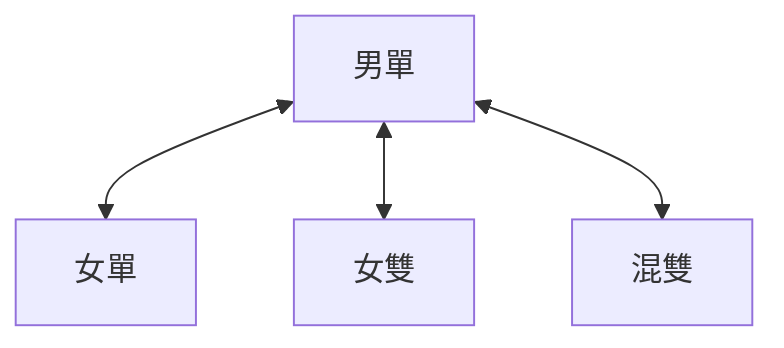
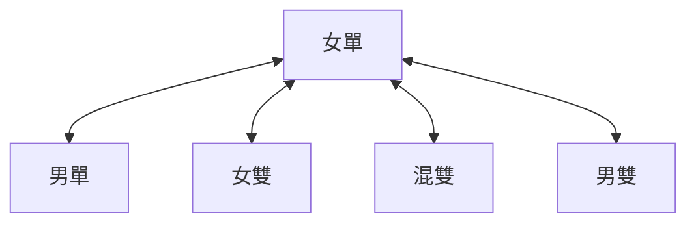
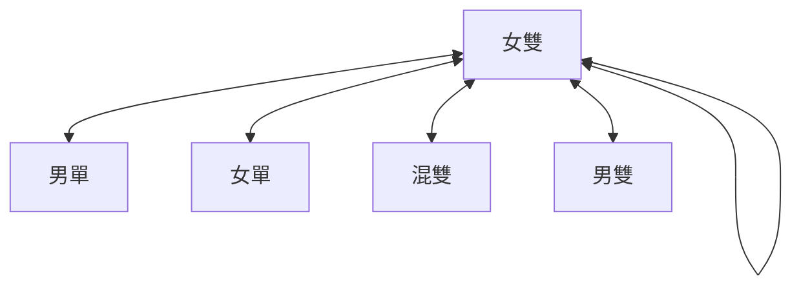
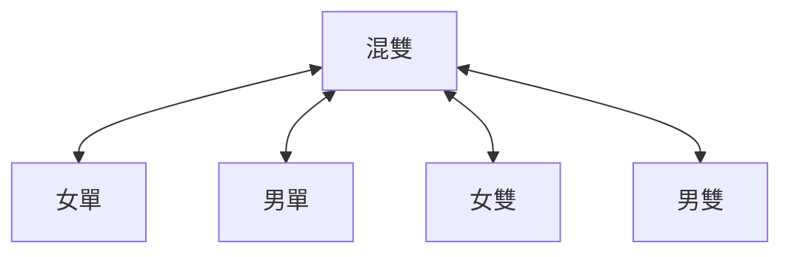

# Chapter 1

```mermaid
    graph TD;
        男單<-->女單;
        男單<-->女雙;
        男單<-->混雙;
```

```mermaid
    graph TD;
        女單<-->男單;
        女單<-->女雙;
        女單<-->混雙;
        女單<-->男雙;
        
```

```mermaid
    graph TD;
        女雙<-->男單;
        女雙<-->女單;
        女雙<-->女雙;
        女雙<-->混雙;
        女雙<-->男雙;
        
```

```mermaid
    graph TD;
        混雙 <-->女單;
        混雙 <-->男單;
        混雙 <-->女雙;
        混雙 <-->男雙;

```
