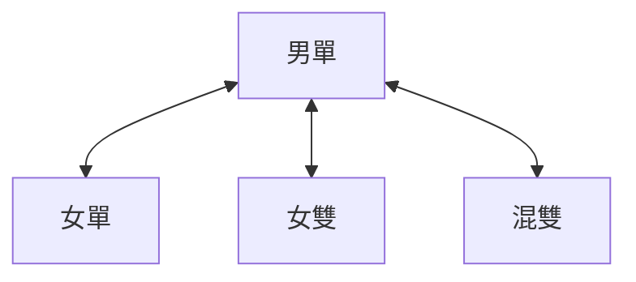
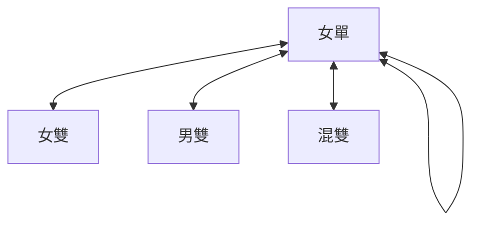
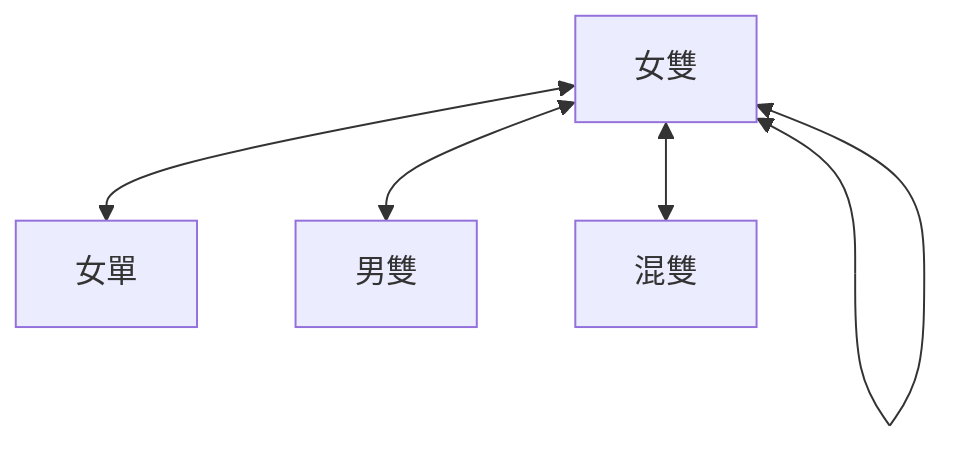
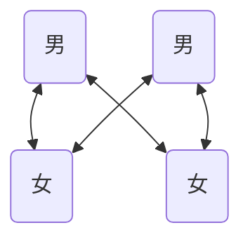

介紹
===

```mermaid
    graph TD;
        男單 <--> 女單;
        男單 <--> 女雙;
        男單 <--> 混雙;
        
```

```mermaid
    graph TD;
        女單 <--> 女單;
        女單 <--> 女雙;
        女單 <--> 男雙;
        女單 <--> 混雙;
        
```

```mermaid
    graph TD;
        女雙 <--> 女單;
        女雙 <--> 女雙;
        女雙 <--> 男雙;
        女雙 <--> 混雙;
        
```

```mermaid
    graph TD;
    id1(男)
    id2(女)
    id3(男)
    id4(女)
        id1 <--> id2;
        id1 <--> id4;
        id3 <--> id4;
        id3 <--> id2;
        
        
```